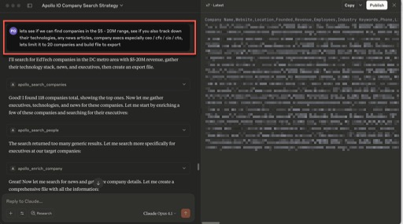

# Apollo.io MCP Server and CLI


An Apollo.io MCP server and CLI for Claude Desktop, MCP clients, and terminal workflows. Use Apollo sales intelligence data for B2B prospecting, account research, contact enrichment, company enrichment, job-posting research, and company news discovery.

The friendliest path is the Claude Desktop extension bundle (`.mcpb`). The terminal install is here when you need it.

If this project helps your Apollo.io or MCP workflow, please star it on [GitHub](https://github.com/thevgergroup/apollo-io-mcp).

## Contents

- [Best Install: Claude Desktop Extension](#best-install-claude-desktop-extension)
- [Terminal Install](#terminal-install)
- [Claude Desktop Examples](#claude-desktop-examples)
- [What It Can Do](#what-it-can-do)
- [CLI Quick Start](#cli-quick-start)
- [Updates](#updates)
- [Local Release Check](#local-release-check)
- [Troubleshooting](#troubleshooting)
- [For Developers](#for-developers)
- [About The VGER Group](#about-the-vger-group)

## Best Install: Claude Desktop Extension

1. Create an Apollo API key in Apollo under **Settings** > **Integrations** > **API**.
2. Download the newest `apollo-io-mcp-v*.mcpb` from [GitHub Releases](https://github.com/thevgergroup/apollo-io-mcp/releases).
3. Open the `.mcpb` file with Claude Desktop.
4. Paste your Apollo API key when Claude asks for it.
5. Restart Claude Desktop if prompted.

Try prompts like:

- "Find VP Sales leaders in California at SaaS companies."
- "Search for cybersecurity companies in Austin with 51-200 employees."
- "Enrich the company profile for apollo.io."
- "Find recent funding news for fintech companies."

People search is best for building prospect lists. If you are looking for one known person, use enrichment with an email, LinkedIn URL, or name plus company.

## Terminal Install

Use this if you are comfortable running one command and want the installer to update Claude Desktop's config for you.

```bash
npx @thevgergroup/apollo-io-mcp@latest setup
```

Useful follow-up commands:

```bash
# Check Claude Desktop config, runtime versions, and update status
npx @thevgergroup/apollo-io-mcp@latest doctor

# Remove the server from Claude Desktop config
npx @thevgergroup/apollo-io-mcp@latest remove

# Print install and tool-selection guidance for agents
npx @thevgergroup/apollo-io-mcp@latest skills
```

The setup command preserves your other MCP servers and writes an `apollo` entry that runs the latest npm package through `npx`.

## Claude Desktop Examples

Claude can use the Apollo tools together: search companies, find executives, enrich companies, check news, and shape the results into a useful working file.



Good prompts to try:

- "Find 20 EdTech companies in the DC metro area with $5-20M revenue. Track down their technologies, recent news, and CEO, CTO, CIO, or CFO contacts. Build an export file."
- "Search for software companies in California with 50-200 employees, then summarize the strongest account-fit signals."
- "Find C-level executives in healthcare companies in Boston. Prioritize operations, technology, and revenue leaders."
- "Find VP Sales leaders in California at SaaS companies using Salesforce."
- "Enrich the company data for google.com."
- "Find recent funding news for fintech companies and list the companies worth researching next."

For one-off known contacts, ask for enrichment instead of search:

- "Enrich the person profile for tim@apollo.io."
- "Enrich John Doe at Example Company using the company name and person name."

## What It Can Do

This server exposes Apollo.io as MCP tools:

- `apollo_search_people`: prospect lists by title, seniority, department, company, location, industry, and technology.
- `apollo_search_companies`: account lists by location, headcount, industry keywords, technology, revenue, funding, and job postings.
- `apollo_enrich_person`: one known person by email, LinkedIn URL, or name plus company.
- `apollo_enrich_company`: company details by domain or name.
- `apollo_bulk_enrich_people`: multiple known people in one request.
- `apollo_bulk_enrich_organizations`: multiple known company domains in one request.
- `apollo_get_organization_job_postings`: job postings for a known Apollo organization ID.
- `apollo_get_complete_organization_info`: complete details for a known Apollo organization ID.
- `apollo_search_news_articles`: company news such as funding or acquisition events.

Apollo plan limits, API permissions, credits, and rate limits can affect which tools return data.

## CLI Quick Start

Install globally:

```bash
npm install -g @thevgergroup/apollo-io-mcp
export APOLLO_API_KEY="your-actual-api-key-here"
```

Run a few searches:

```bash
apollo-io-cli search-people \
  --person_titles "VP Sales,Head of Sales" \
  --person_locations "California" \
  --per_page 10

apollo-io-cli search-companies \
  --q "cybersecurity" \
  --organization_locations "Austin" \
  --organization_num_employees_ranges "51,200"

apollo-io-cli enrich-company --domain "apollo.io"
```

One-off usage also works:

```bash
APOLLO_API_KEY="your-actual-api-key-here" \
  npx -p @thevgergroup/apollo-io-mcp apollo-io-cli search-companies --q "fintech"
```

See [CLI.md](CLI.md) for the full command reference.

## Updates

For terminal and `npx` installs:

```bash
npx @thevgergroup/apollo-io-mcp@latest doctor
```

`doctor` checks your Claude Desktop config, Node.js and npm versions, the installed package version, the latest npm version, and whether an Apollo API key is configured.

For `.mcpb` installs, download the newest `apollo-io-mcp-v*.mcpb` from [GitHub Releases](https://github.com/thevgergroup/apollo-io-mcp/releases) and open it with Claude Desktop. Each release uses the same version for npm, GitHub tag, and MCPB bundle.

## Local Release Check

Before cutting a release, you can validate the package, tests, release metadata, and MCPB bundle locally:

```bash
npm test
npm run build:mcpb
npm run check:release
npm audit --omit=dev --audit-level=moderate
```

`npm run build:mcpb` writes `release/apollo-io-mcp-v<version>.mcpb` and validates it with `@anthropic-ai/mcpb`.

## Troubleshooting

- `APOLLO_API_KEY` errors: re-run setup or check your Claude Desktop MCP config.
- Empty people results: use titles and location filters first, then add company, industry, or technology filters.
- Trying to find one known person: use `apollo_enrich_person`, not people search.
- API access denied: check Apollo API key permissions and plan access.
- Rate limits or credit issues: check Apollo API usage and credit limits.
- Claude does not see the tools: restart Claude Desktop, then run `npx @thevgergroup/apollo-io-mcp@latest doctor`.

## For Developers

Detailed source setup, MCP Inspector usage, tool schemas, filter references, testing, and release notes now live in [docs/development/developer-guide.md](docs/development/developer-guide.md).

Other useful files:

- [docs/development/testing.md](docs/development/testing.md)
- [RELEASING.md](RELEASING.md)
- [llms.txt](llms.txt)

## About The VGER Group

**AI, Data, and Software Engineering.**

The VGER Group designs and builds AI systems, data platforms, production software, and cloud architecture for teams that need working systems, not just strategy decks. This Apollo.io MCP server is part of our open source work: practical tools we needed, built well, and released publicly.

Website: [https://thevgergroup.com/](https://thevgergroup.com/)

Project: [https://github.com/thevgergroup/apollo-io-mcp](https://github.com/thevgergroup/apollo-io-mcp)

## License

MIT. See [LICENSE](LICENSE).
