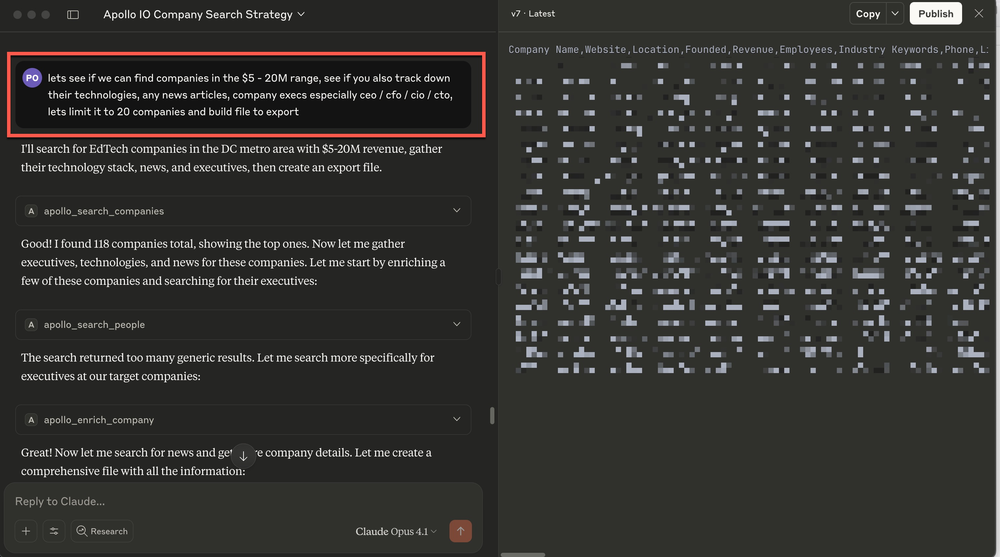

# Apollo.io MCP Server

A Model Context Protocol (MCP) server for Apollo.io that integrates with Claude Desktop. This server provides access to Apollo's comprehensive B2B database for people and company search, enrichment, and insights.

- [Apollo.io MCP Server](#apolloio-mcp-server)
  - [Features](#features)
  - [Claude Desktop Setup](#claude-desktop-setup)
    - [Step 1: Get Your Apollo API Key](#step-1-get-your-apollo-api-key)
    - [Step 2: Configure Claude Desktop](#step-2-configure-claude-desktop)
      - [Using npx (Recommended)](#using-npx-recommended)
      - [If using a Developer Installation (unlikely)](#if-using-a-developer-installation-unlikely)
    - [Step 3: Test the Integration](#step-3-test-the-integration)
  - [Manual Setup (For Developers)](#manual-setup-for-developers)
    - [Claude Desktop Configuration for Source Installation](#claude-desktop-configuration-for-source-installation)
  - [Available Tools](#available-tools)
    - [Search Tools](#search-tools)
      - [`apollo_search_people`](#apollo_search_people)
      - [`apollo_search_companies`](#apollo_search_companies)
    - [Enrichment Tools](#enrichment-tools)
      - [`apollo_enrich_person`](#apollo_enrich_person)
      - [`apollo_enrich_company`](#apollo_enrich_company)
      - [`apollo_bulk_enrich_people`](#apollo_bulk_enrich_people)
      - [`apollo_bulk_enrich_organizations`](#apollo_bulk_enrich_organizations)
    - [Additional Tools](#additional-tools)
      - [`apollo_get_organization_job_postings`](#apollo_get_organization_job_postings)
      - [`apollo_get_complete_organization_info`](#apollo_get_complete_organization_info)
      - [`apollo_search_news_articles`](#apollo_search_news_articles)
  - [Filter Reference](#filter-reference)
    - [Company Search Filters](#company-search-filters)
    - [People Search Filters](#people-search-filters)
  - [Claude Desktop Integration](#claude-desktop-integration)
  - [Testing](#testing)
    - [Run all tests:](#run-all-tests)
    - [Run CLI integration test:](#run-cli-integration-test)
    - [Test specific filters:](#test-specific-filters)
    - [Test MCP Inspector integration:](#test-mcp-inspector-integration)
    - [Test with MCP Inspector (Visual Testing Tool)](#test-with-mcp-inspector-visual-testing-tool)
      - [Setup Inspector:](#setup-inspector)
      - [MCP Inspector Configuration](#mcp-inspector-configuration)
      - [Run Inspector (UI Mode):](#run-inspector-ui-mode)
      - [Run Inspector (CLI Mode):](#run-inspector-cli-mode)
      - [Inspector Features:](#inspector-features)
  - [Environment Setup](#environment-setup)
  - [Troubleshooting](#troubleshooting)
    - [Common Issues](#common-issues)
    - [Filter Best Practices](#filter-best-practices)
  - [API References](#api-references)
  - [Contributing](#contributing)
  - [License](#license)


## Features

- **Apollo Org and People Search** covering all major Apollo.io API endpoints
- **Claude Desktop optimized** Simple ICP discovery
- **Advanced filtering** with Apollo.io API parameter mapping

## Claude Desktop Setup

This MCP server is designed to work seamlessly with Claude Desktop. Follow these steps to get started:



### Step 1: Get Your Apollo API Key

Before setting up the MCP server, you'll need an Apollo API key:

1. **Launch Apollo** and go to **Settings** > **Integrations**
2. **Find the API option** and click **Connect**
3. **Click "API keys"** to view or create new API keys, then click **Create new key**
4. **Name your API key** (e.g., "Claude Desktop Integration") and add a description
5. **Select the endpoints** you need access to, or toggle **"Set as master key"** for full access
6. **Click "Create API key"** and copy the key to a safe location

> **Important**: Keep your API key secure. Anyone with access to this key can make API calls through your Apollo account.

> **Note**: API access is dependent on your Apollo pricing plan. Check [Apollo's pricing page](https://apollo.io/pricing) for details on API limits and features available with your plan.

For more details, see the [Apollo API Key Creation Guide](https://docs.apollo.io/docs/create-api-key).

### Step 2: Configure Claude Desktop

Add this configuration to your Claude Desktop MCP settings:

#### Using npx (Recommended)

```json
{
  "mcpServers": {
    "apollo": {
      "command": "npx",
      "args": ["@thevgergroup/apollo-io-mcp@latest"],
      "env": {
        "APOLLO_API_KEY": "your-actual-api-key-here",
        "APOLLO_BASE_URL": "https://api.apollo.io/api/v1"
      }
    }
  }
}
```

#### If using a Developer Installation (unlikely)

```json
{
  "mcpServers": {
    "apollo": {
      "command": "node",
      "args": ["./node_modules/@thevgergroup/apollo-io-mcp/dist/server.js"],
      "env": {
        "APOLLO_API_KEY": "your-actual-api-key-here",
        "APOLLO_BASE_URL": "https://api.apollo.io/api/v1"
      }
    }
  }
}
```

**Replace `your-actual-api-key-here` with the API key you created in Step 1.**

### Step 3: Test the Integration

Once configured, restart Claude Desktop and try asking:

- "Search for software companies in California with 50-200 employees"
- "Find C-level executives in the healthcare industry"
- "Enrich the company data for google.com"


## Manual Setup (For Developers)

If you prefer to install from source or need to modify the code:

1. **Clone the repository:**
```bash
git clone https://github.com/thevgergroup/apollo-io-mcp
cd apollo-io-mcp
```

2. **Install dependencies:**
```bash
npm install
```

3. **Set up environment variables:**
```bash
# Only if .env doesn't already exist
cp env.example .env
```

4. **Edit `.env` and add your Apollo.io API key:**
```bash
APOLLO_API_KEY=your-actual-api-key-here
APOLLO_BASE_URL=https://api.apollo.io/api/v1
```

5. **Build the project:**
```bash
npm run build
```

### Claude Desktop Configuration for Source Installation

```json
{
  "mcpServers": {
    "apollo": {
      "command": "node",
      "args": ["/path/to/apollo-io-mcp/dist/server.js"],
      "env": {
        "APOLLO_API_KEY": "your-actual-api-key-here",
        "APOLLO_BASE_URL": "https://api.apollo.io/api/v1"
      }
    }
  }
}
```

## Available Tools

### Search Tools

#### `apollo_search_people`
Search for people in Apollo's database with advanced filtering options. The tool provides comprehensive filter documentation to help target specific roles, locations, seniority levels, and companies.

**Available Filters:**
- `locations`: Person locations (cities, states, countries)
- `seniority`: Seniority levels (e.g., `["C-Level", "VP", "Director"]`)
- `titles`: Job titles (e.g., `["CEO", "CTO", "Sales Manager"]`)
- `departments`: Departments (e.g., `["Engineering", "Sales", "Marketing"]`)
- `company_domains`: Company domains (e.g., `["google.com", "microsoft.com"]`)
- `industries`: Industries (e.g., `["Software", "Healthcare", "Finance"]`)
- `technologies`: Technologies they use (e.g., `["python", "react", "salesforce"]`)

**Example:**
```json
{
  "query": "CEO",
  "filters": {
    "locations": ["California"],
    "seniority": ["C-Level"],
    "industries": ["Software", "SaaS"]
  },
  "per_page": 10
}
```

#### `apollo_search_companies`
Search for companies/organizations with comprehensive filtering options. The tool provides detailed documentation for all available filters to help target specific company types, locations, sizes, and industries.

**Available Filters:**
- `organization_locations`: Company locations (most effective filter)
- `organization_not_locations`: Exclude specific locations
- `q_organization_keyword_tags`: Industry keywords (crucial for targeting)
- `organization_num_employees_ranges`: Employee count ranges (very restrictive)
- `currently_using_any_of_technology_uids`: Technologies companies use
- `revenue_range`: Revenue range in dollars
- `latest_funding_amount_range`: Latest funding round amount
- `total_funding_range`: Total funding amount
- `q_organization_job_titles`: Job titles in active postings

**Example:**
```json
{
  "query": "education technology",
  "filters": {
    "organization_locations": ["Virginia", "Maryland", "Washington DC"],
    "q_organization_keyword_tags": ["edtech", "online learning", "education technology"],
    "organization_num_employees_ranges": ["11,20", "21,50", "51,100"]
  },
  "per_page": 25
}
```

**Filter Best Practices:**
- **Start with location filters** - They're most effective at narrowing results
- **Use specific keywords** - Generic terms return too many results
- **Combine multiple filters** - Employee ranges + location + keywords work best
- **Use comma-separated employee ranges** - Format as `"11,20"` not `"11-20"`
- **Employee range filters are very restrictive** - If you get 0 results, try broader ranges or remove employee filters
- **Test filters incrementally** - Start with location + keywords, then add employee ranges if needed

### Enrichment Tools

#### `apollo_enrich_person`
Enrich a person's profile using email, LinkedIn URL, or name+company.

#### `apollo_enrich_company`
Enrich a company's profile using domain or name.

#### `apollo_bulk_enrich_people`
Bulk enrich multiple people profiles.

#### `apollo_bulk_enrich_organizations`
Bulk enrich multiple organization profiles.

### Additional Tools

#### `apollo_get_organization_job_postings`
Get job postings for a specific organization.

#### `apollo_get_complete_organization_info`
Get complete information for a specific organization.

#### `apollo_search_news_articles`
Search for news articles related to companies.

## Filter Reference

### Company Search Filters

| Filter | Type | Description | Example |
|--------|------|-------------|---------|
| `organization_num_employees_ranges` | array | Employee count ranges (comma-separated) | `["11,20", "21,50"]` |
| `organization_locations` | array | Company locations | `["Virginia", "Maryland"]` |
| `organization_not_locations` | array | Exclude locations | `["California"]` |
| `q_organization_keyword_tags` | array | Industry keywords | `["edtech", "saas"]` |
| `q_organization_name` | string | Company name filter | `"Google"` |
| `currently_using_any_of_technology_uids` | array | Technologies used | `["salesforce", "aws"]` |
| `revenue_range` | object | Revenue range (min/max) | `{"min": 1000000, "max": 10000000}` |
| `latest_funding_amount_range` | object | Latest funding range | `{"min": 5000000, "max": 50000000}` |
| `total_funding_range` | object | Total funding range | `{"min": 10000000, "max": 100000000}` |

### People Search Filters

| Filter | Type | Description | Example |
|--------|------|-------------|---------|
| `locations` | array | Person locations | `["California", "New York"]` |
| `seniority` | array | Seniority levels | `["C-Level", "VP"]` |
| `departments` | array | Departments | `["Engineering", "Sales"]` |
| `titles` | array | Job titles | `["CEO", "CTO"]` |

## Claude Desktop Integration

This MCP server has been thoroughly tested and works seamlessly with Claude Desktop. All tests pass and the MCP protocol is fully implemented. The server includes 9 comprehensive tools covering all major Apollo.io API endpoints.

**Optimized for Claude Desktop**: Responses are simplified and optimized for Claude Desktop compatibility, reducing response size by up to 94% while preserving all essential information.

## Testing

### Run all tests:
```bash
npm test
```

### Run CLI integration test:
```bash
node test-cli.js
```

### Test specific filters:
```bash
node test-filters.js
```

### Test MCP Inspector integration:
```bash
node test-inspector.js
```

### Test with MCP Inspector (Visual Testing Tool)

The [MCP Inspector](https://github.com/modelcontextprotocol/inspector) provides a visual interface for testing and debugging MCP servers.

#### Setup Inspector:
```bash
# Install dependencies and setup inspector
npm install
./setup-inspector.sh
```

The setup script will automatically configure the MCP Inspector with your API key from the `.env` file.

#### MCP Inspector Configuration

The inspector uses this configuration (automatically set up by the script):

```json
{
  "mcpServers": {
    "apollo": {
      "command": "node",
      "args": ["dist/server.js"],
      "env": {
        "APOLLO_API_KEY": "your-api-key-here",
        "APOLLO_BASE_URL": "https://api.apollo.io/api/v1"
      }
    }
  }
}
```

#### Run Inspector (UI Mode):
```bash
npm run inspector
```
This opens a web interface at `http://localhost:6274` where you can:
- Browse all available tools with their documentation
- Test tools with form-based parameter input
- View real-time responses and errors
- Explore the MCP protocol implementation

#### Run Inspector (CLI Mode):
```bash
# List all available tools
npm run inspector:cli -- --method tools/list

# Test company search
npm run inspector:cli -- --method tools/call --tool-name apollo_search_companies --tool-arg query='education technology' --tool-arg per_page=5

# Test with filters
npm run inspector:cli -- --method tools/call --tool-name apollo_search_companies --tool-arg query='edtech' --tool-arg 'filters={"organization_locations":["Virginia"],"q_organization_keyword_tags":["edtech"]}' --tool-arg per_page=3
```

#### Inspector Features:
- **Visual Tool Testing**: Form-based interface for all tools
- **Real-time Response Viewing**: See API responses as they come in
- **Error Debugging**: Visual error messages and stack traces
- **Protocol Inspection**: View the underlying MCP protocol messages
- **Documentation Display**: See all tool descriptions and parameter schemas

## Environment Setup

The API key setup is covered in the [Claude Desktop Setup](#claude-desktop-setup) section above. For reference:

- **For npx/npm users**: Set environment variables in your Claude Desktop MCP configuration
- **For source users**: Create a `.env` file in the project directory with your API key

## Troubleshooting

### Common Issues

1. **"Unauthorized" errors**: Check your `APOLLO_API_KEY` in the `.env` file or environment variables
2. **"Rate limited" errors**: You've hit Apollo's API rate limits. Check your [Apollo API usage dashboard](https://docs.apollo.io/docs/create-api-key#track-api-usage) for current limits
3. **Large result sets**: Use more specific filters to narrow results
4. **Empty company results**: Try different filter combinations or check API limits
5. **API access denied**: Some endpoints require specific API key permissions. Ensure your key has access to the endpoints you're trying to use

### Filter Best Practices

1. **Start with location filters** - They're most effective at narrowing results
2. **Use specific keywords** - Generic terms return too many results
3. **Combine multiple filters** - Employee ranges + location + keywords work best
4. **Use comma-separated employee ranges** - Format as `"11,20"` not `"11-20"`
5. **Employee range filters are very restrictive** - If you get 0 results, try broader ranges or remove employee filters
6. **Test filters incrementally** - Start with location + keywords, then add employee ranges if needed

## API References

- [Apollo.io API Documentation](https://docs.apollo.io/reference/)
- [Model Context Protocol](https://modelcontextprotocol.io/)
- [Claude Desktop MCP Setup](https://docs.anthropic.com/en/docs/claude-desktop-mcp)

## Contributing

1. Fork the repository
2. Create a feature branch
3. Make your changes
4. Add tests for new functionality
5. Submit a pull request

## Releasing

This project uses semantic versioning and automated publishing. See [RELEASING.md](RELEASING.md) for detailed instructions.

Quick release commands:
```bash
npm run release:patch  # Bug fixes
npm run release:minor  # New features
npm run release:major  # Breaking changes
```

## License

This project is licensed under the MIT License - see the LICENSE file for details.